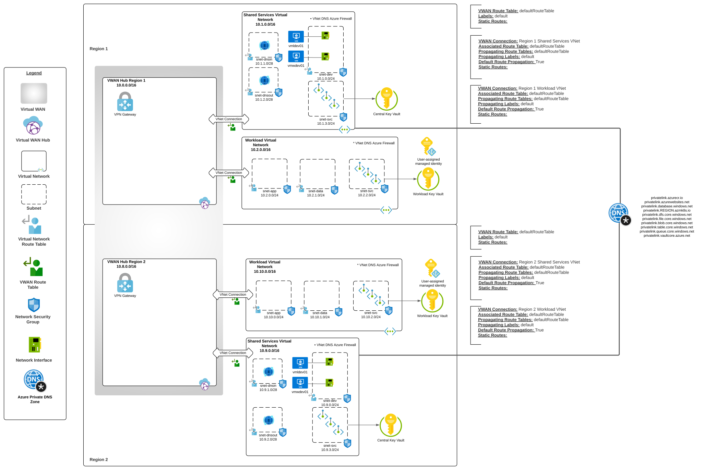

# Azure VWAN Secure Hub - Multi-Region"

## Updates
7/2023 - Initial release

## Overview
Microsoft has positioned [Azure VWAN (Virtual WAN)](https://learn.microsoft.com/en-us/azure/virtual-wan/virtual-wan-about) to be the next evolution of the traditional [hub and spoke networking architecture](https://docs.microsoft.com/en-us/azure/architecture/reference-architectures/hybrid-networking/hub-spoke?tabs=cli). VWAN provides new features that allow for out-of-the-box transitive connectivity, additional support for [SD-WAN connectivity](https://learn.microsoft.com/en-us/azure/virtual-wan/sd-wan-connectivity-architecture), [new routing capabilities](https://learn.microsoft.com/en-us/azure/virtual-wan/about-virtual-hub-routing), and even [managed security appliances](https://learn.microsoft.com/en-us/azure/firewall-manager/secured-virtual-hub?toc=%2Fazure%2Fvirtual-wan%2Ftoc.json). With any new product, there are feature gaps and VWAN is no exception. Organizations operating in regulated industries must exercise considerable planning to determine if VWAN's current capabilities and limitations satisfy its organizational requirements.

This lab provides a multi-region environment supporting optional north/south and east/west traffic inspection and central mediation using Azure Firewall and [routing intent](https://learn.microsoft.com/en-us/azure/virtual-wan/how-to-routing-policies). The network design used in this lab is referred to as the [VWAN Secure Hub](https://learn.microsoft.com/en-us/azure/firewall-manager/secured-virtual-hub). 

The lab deploys an Azure VWAN deployed in multiple regions each with a Secure Hub hosting an Azure Firewall instance. A VPN Gateway is provisioned into each Secure Hub to allow for site-to-site VPN connectivity.

Directly attached to the VWAN Secure Hub are two virtual networks. 

The shared services virtual network contains an [Azure Private DNS Resolver](https://learn.microsoft.com/en-us/azure/dns/dns-private-resolver-overview) and is linked to multiple Azure Private DNS Zones used by common Azure PaaS services. All virtual networks are configured to use the Private DNS Resolver for DNS resolution. Ubuntu and Windows VMs are deployed as utility servers. The Windows VM comes loaded with Google Chrome, Visual Studio Code, Azure CLI, and Azure PowerShell. The Linux VM comes loaded with Azure CLI, kubectl, and Docker. 

The workload virtual network is deployed with an app, data, and supported services (PaaS services behind Private Endpoints) subnets. The workload resource group also contains a user-assigned managed identity which has been given permissions to get and list secrets in a Key Vault instance.

Routing intent IS NOT ENABLED by default in this lab. You can enable the routing policies supporting routing intent [using the Microsoft documentation](https://learn.microsoft.com/en-us/azure/virtual-wan/how-to-routing-policies). 

An Azure Bastion was not configured with this lab to allow support for enabling the Internet routing policy. [Azure Bastion DOES NOT support propagation of a default route into its subnet](https://learn.microsoft.com/en-us/azure/bastion/bastion-faq#vwan). It also does not support the assignment of a user-defined route table to the subnet which prohibits the option to disable BGP propagation of the default route to the virtual network. If you choose to add an Azure Bastion to this lab you will not be able to test the Internet routing policy.

Additional features included:

* An Azure Key Vault instance which stores the user configured VM administrator username and password
* An Azure Key Vault instance for workloads deployed into the workload resource group
* All instances of Azure Key Vault are deployed with a Private Endpoint
* All subnets that support Network Security Groups are configured with them except for the inner subnet used by the VMs in the mediation virtual network
* Network Security Groups are configured with NSG Flow Logs which are set to an Azure Storage Account and Traffic Analytics
* Subnets are configured so that Private Endpoints support Network Security Groups
* A Log Analytics Workspace is provisioned and can be used for centralized logging.
* Resources that support integration with Log Analytics have been configured for logging

## Prerequisites
1. You must hold the Owner role within each Azure subscription you configure the template to deploy resources to. Contributor may work but has not been tested.

2. Get the object id of the security principal (user, managed identity, service principal) that will have access to the Azure Key Vault instance. This will be used for the keyVaultAdmin parameter of the template. Ensure you are using the most up to date version of az cli.

**az ad user show --id someuser@sometenant.com --query id --output tsv**

3. Enable Network Watcher in the region you plan to deploy the resources using the Azure Portal method described in this link. Do not use the CLI option because the templates expect the Network Watcher resource to be named NetworkWatcher_REGION, such as NetworkWatcher_eastus2. The CLI names the resource watcher_REGION such as watcher_eastus2 which will cause the deployment of the environment to fail.

## Installation with Azure Portal

## Installation with Azure CLI
1. Set the following variables:
   * NAME - The name of the deployment
   * LOCATION - The primary Azure region to deploy the resources to.
   * ADMIN - The name to set for the VM administrator username
   * USER - The object ID of the Azure AD User that will have full permissions on the Key Vault instances
   * SUBSCRIPTION - The name or id of the subscription you wish to deploy the resources to
   * PRIMARY_LOCATION - The first region to deploy to
   * SECONDARY_LOCATION - The second region to deploy to

2. Set the CLI to the subscription you wish to deploy the resources to:

   * **az account set --subscription SUBSCRIPTION_ID**

4. Deploy the lab using the command (tags parameter is optional): 

   * **az deployment sub create --name $NAME --location $PRIMARY_LOCATION --template-uri https://raw.githubusercontent.com/mattfeltonma/azure-labs/master/vwan-secure-hub-multi-region/azuredeploy.json --parameters primaryLocation=$PRIMARY_LOCATION secondaryLocation=$SECONDARY_LOCATION vmAdminUsername=$ADMIN keyVaultAdmin=$USER tags='{"mytag":"value"}'**

3.  You will be prompted to provide a password for the local administrator of the virtual machines. The username and password you set will be available to you as secrets in the Key Vault provisioned as part of this lab.

## Post Installation
Once the lab is deployed you can connect to one of the virtual machines by provisioning an Azure Bastion (note that enabling Internet routing policies will break the Azure Bastion with this lab configuration), enabling one of the virtual machines for public access over RDP/SSH, or connecting via a site-to-site VPN. 

## Removal
Once finished with the lab you can delete the resource groups.

